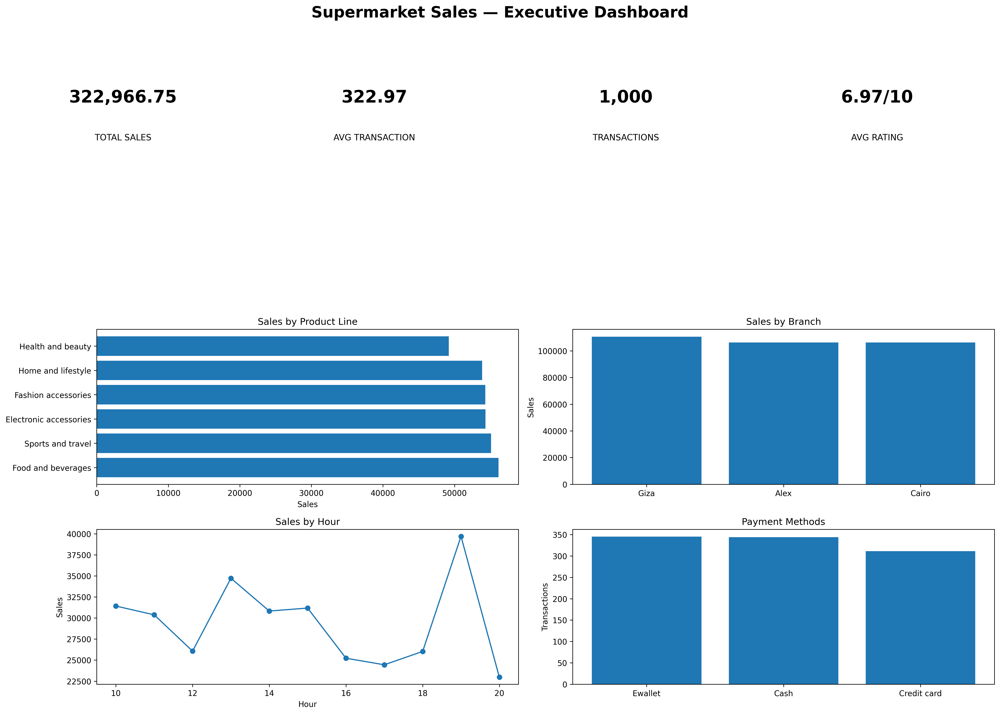
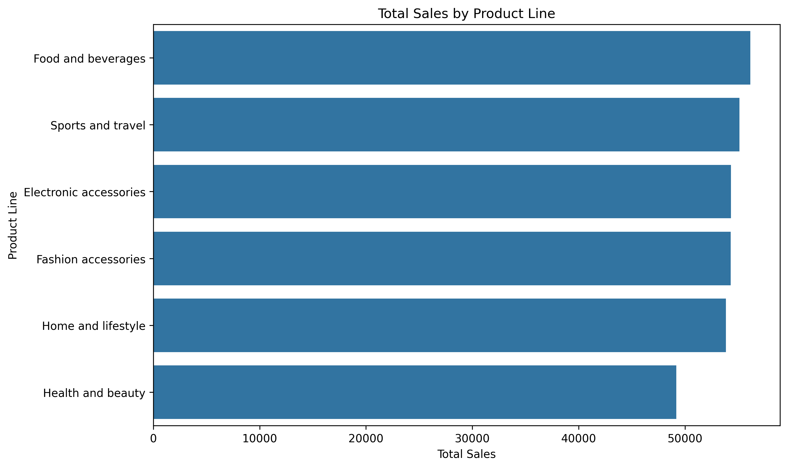
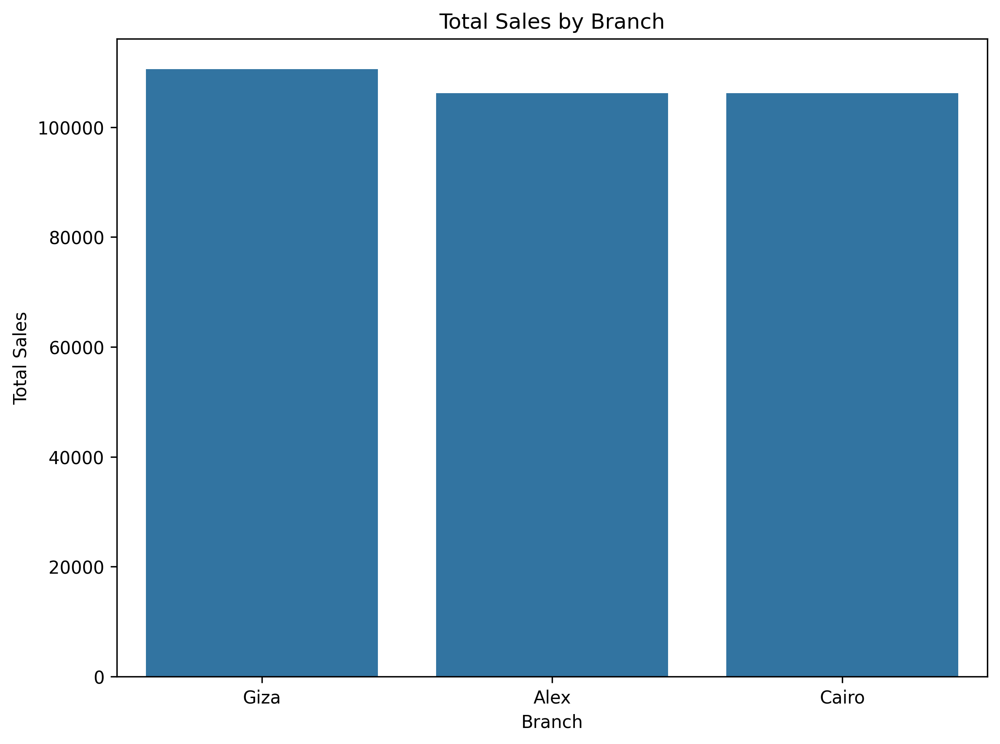
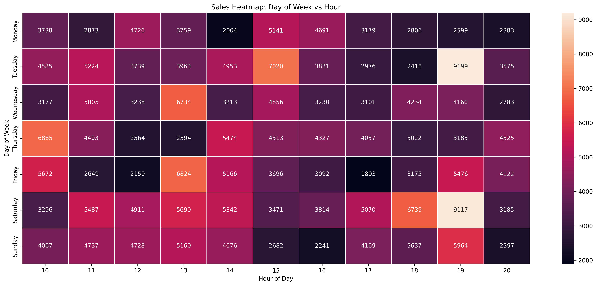
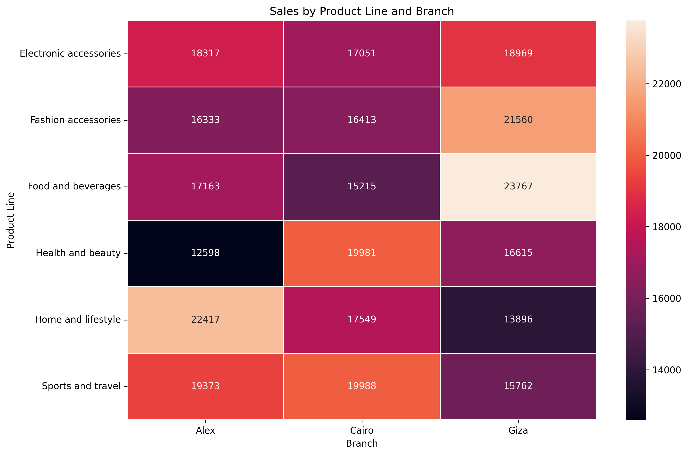
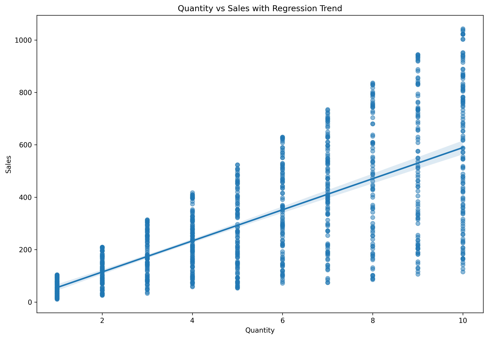
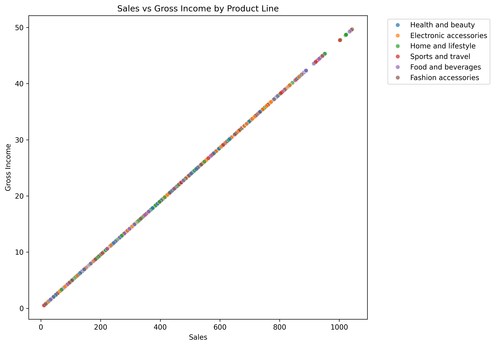
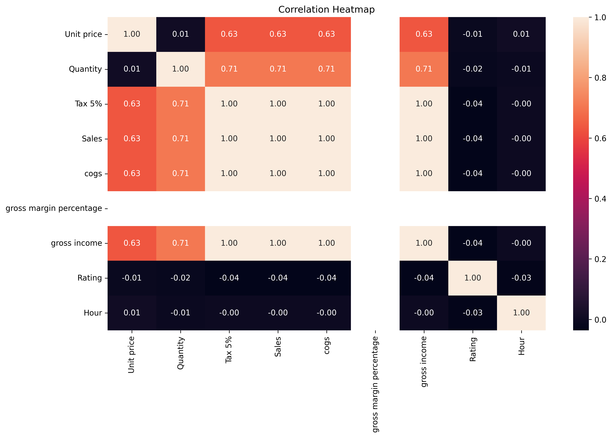

# CodeAlpha — Supermarket Sales Data Visualization

## Project Overview

This project was completed as **Task 3: Data Visualization** for the CodeAlpha Data Analytics Internship.

The project transforms supermarket transaction data into clear, informative visualizations designed to communicate sales performance, customer behavior, product performance, time-based patterns, relationships, and potential anomalies.

The project uses Python visualization libraries to create charts, analytical visualizations, and an executive dashboard.

## Objectives

The project aims to:

* Transform raw transaction data into meaningful visualizations.
* Identify important sales patterns and trends.
* Compare product-line and branch performance.
* Explore customer and payment behavior.
* Analyze time-based sales activity.
* Visualize relationships between numerical variables.
* Communicate analytical findings through data storytelling.
* Produce portfolio-ready visualization outputs.

## Technologies

* Python
* Pandas
* NumPy
* Matplotlib
* Seaborn
* Jupyter Notebook

## Dataset

The analysis uses a supermarket sales dataset containing 1,000 transaction records.

Important variables include:

* Branch
* City
* Customer type
* Gender
* Product line
* Unit price
* Quantity
* Tax
* Sales
* COGS
* Gross margin percentage
* Gross income
* Payment
* Rating
* Date
* Time

## Visualizations

### Executive Dashboard

A dashboard-style summary combines key performance indicators with major sales visualizations.



### Sales by Product Line

Compares total sales generated by each product category.



### Sales by Branch

Compares total sales across branches.



### Sales Day-Hour Heatmap

Shows how sales vary simultaneously by day of week and hour.



### Product Line and Branch Heatmap

Compares sales performance of product categories across branches.



### Quantity and Sales Relationship

Shows the relationship between quantity purchased and total sales, including the regression trend.



### Product-Line Sales Distribution

Compares the distribution and variation of transaction values across product categories.


### Average Transaction Value by Hour

Shows how the average value of transactions changes throughout the day.


### Sales and Gross Income

Explores the relationship between sales and gross income while distinguishing product lines.



### Correlation Heatmap

Shows correlations among numerical variables in the dataset.



## Key Findings

* Food and beverages generated the highest total sales.
* Electronic accessories recorded the highest quantity sold.
* Giza recorded the highest total sales among the branches.
* E-wallet was the most frequently used payment method.
* Quantity and Sales showed a positive correlation of approximately 0.706.
* 19:00 was the peak sales hour based on total sales.
* Saturday recorded the highest total sales among days of the week.
* High-value transactions were identified for further investigation.

## Data Story

The visualization analysis demonstrates that sales performance varies across several dimensions. Product-level analysis identifies the major revenue contributors, branch-level analysis shows differences in location performance, and customer analysis provides insight into purchasing behavior.

Time-based visualizations reveal when sales activity is strongest, while heatmaps expose interactions between dimensions such as day, hour, product line, and branch.

The combination of these visual perspectives supports a more complete interpretation of supermarket sales behavior.

## Project Structure

```text
CodeAlpha_DataVisualization/
│
├── data/
│   └── supermarket_sales.csv
│
├── notebooks/
│   └── supermarket_sales_visualization.ipynb
│
├── visualizations/
│   ├── executive_dashboard.png
│   ├── sales_by_product_line.png
│   ├── sales_by_branch.png
│   ├── sales_day_hour_heatmap.png
│   ├── product_branch_heatmap.png
│   ├── quantity_sales_regression.png
│   ├── sales_distribution_product_line.png
│   ├── average_transaction_by_hour.png
│   ├── sales_vs_gross_income.png
│   └── correlation_heatmap.png
│
├── README.md
├── requirements.txt
└── .gitignore
```

## How to Run

Clone the repository:

```bash
git clone YOUR_GITHUB_REPOSITORY_URL
```

Navigate to the project:

```bash
cd CodeAlpha_DataVisualization
```

Install dependencies:

```bash
pip install -r requirements.txt
```

Launch Jupyter:

```bash
jupyter notebook
```

Open:

```text
notebooks/supermarket_sales_visualization.ipynb
```

Run the cells sequentially.

## Internship

This project was completed as part of the **CodeAlpha Data Analytics Internship — Task 3: Data Visualization**.

## Author

**Dawit Tamirat Higissa**

Data Analytics | Python | Data Science
